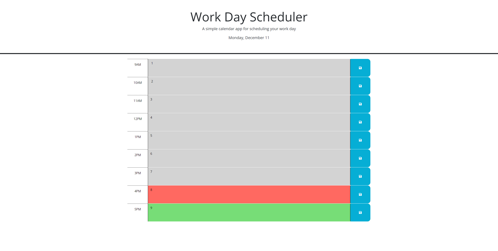

# Workday Planner JS



## Overview

Workday Planner JS is a small program to help organize your workday. It creates time-blocks from 9am-5pm and saves the text you enter to localStorage.

If the time has passed, then the time-block will be grey. The time block will turn red when the current hour matches the correct time-block. The time block will be green when the time-block is in the future.

[Link to Website](https://blockdoyle.github.io/work-planner-js/)

## Table of Contents

- [Workday Planner JS](#workday-planner-js)
  - [Overview](#overview)
  - [Table of Contents](#table-of-contents)
  - [Installation](#installation)
  - [Usage](#usage)

## Installation

Install the code by either downloading the source files manually, or by using 'git clone'.

```bash
git clone https://github.com/blockdoyle/work-planner-js.git
```

## Usage
To view the webpage, either double-click the 'index.html' file, open a live server using Visual Studio Code, or add the files to your Apache HTTP server.